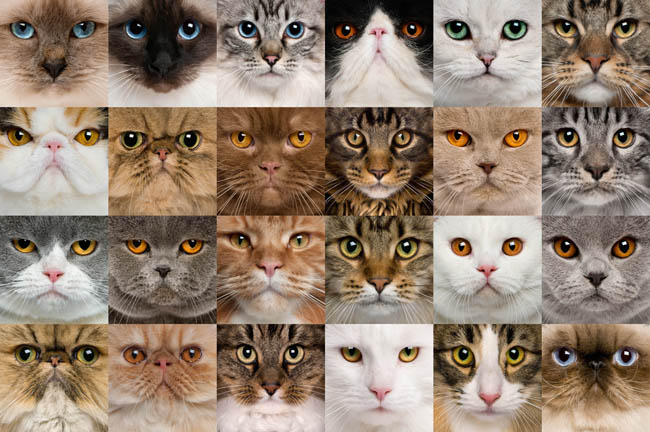

 

# Cats Quiz: what breed is this cat?

  <a href="#overview">Overview</a> •
  <a href="#data-rights">Data Rights</a>

 

## Overview 

Demo Project with 7 images. Use`Visual Tagging` to correctly classify cats breed. 

    
    
Image credit: <a href="https://cat-world.com/what-breed-is-my-cat/">link</a>

## Data Rights
File `image_reference.txt` contains urls to pages and images that are used in `Cats Quiz` project. Use of these images must respect the corresponding terms of use.

